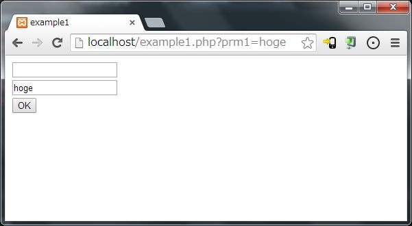
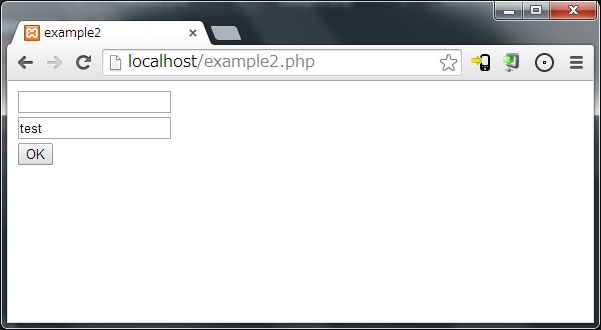
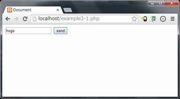
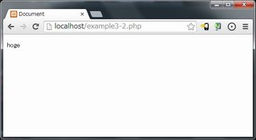
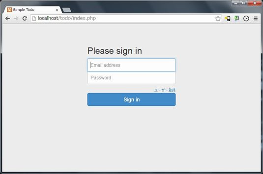
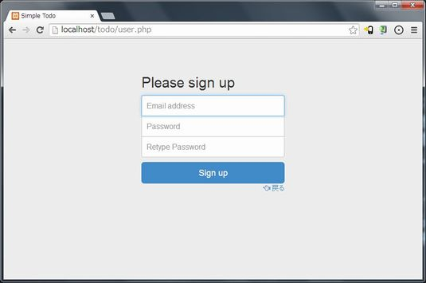
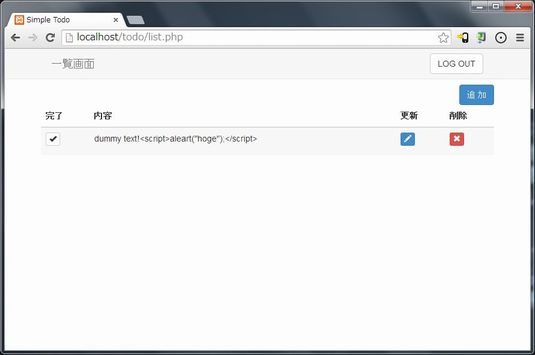
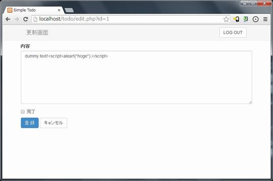

# Webアプリケーション開発入門
### 第１回

<br>

木村 憲規

@KazunoriJs

------

### Webアプリケーションとは？

今回の勉強会では、以下のように定義します。

<br>

クライアントからのリクエストごとに、サーバー側の処理で状況に合わせたページが生成されることにより、何かしらの機能が提供されるWebサイト

<br>
<br>

このようなWebサイトを`Webサービス`と呼ぶ場合もあります。

------

### Webアプリケーション開発

* [Nodeビギナーズブック](http://www.nodebeginner.org/index-jp.html) より

<br>

もし貴方が私と同じであれば、はるか昔HTMLの文書を書いて
HTMLでの"開発"を始めたはずです。

<br>

JavaScriptと呼ばれるなんだか面白そうなものに出会い、
つまり貴方のWebページに相互作用を加えるような、
とても基本的な使い方だけで利用していたことでしょう。

------

貴方はもっと"本物"が欲しくなり、複雑なWebサイトを構築する方法を学びたくて
PHP、 Ruby、Javaなどのプログラミング言語を勉強し、
"バックエンド" となるコードを書き始めたのではないでしょうか。

------

みなさんはどうですか？

<br>

* HTMLを書いたことがありますか？
* JavaScriptを書いたことがありますか？
* PHP、Ruby、JavaなどでWebアプリケーションを書いたことがありますか？

------

* [Nodeビギナーズブック](http://www.nodebeginner.org/index-jp.html) は以下のようにつづきます。

<br>

JavaScriptに注目してみると  
jQuery や Prototype などが目に入ってきました。

<br>

JavaScriptの世界では物事が進化し、  
もはやこの言語は、`window.open()`では済まないのだ、  
ということがわかってきたのです。

<br><br>

そしていま、`Node.js`にたどり着きました。

------

# 開発環境設定

------

これから、Webアプリケーション開発における前提知識について説明します。

実際にコードを実行しながら進めていきますので、先に開発環境を整えます。

------

### ツールなどのインストール

* vim, gitをインストールします。

```
$ su -
# yum install yum-fastestmirror
# yum install -y vim
# yum install -y git-core
```

------

### epelリポジトリを追加

後述のremi-release-6 が依存しているため、最初にepelレポジトリを追加します。

#### 64bit

```
# rpm -ivh http://ftp.riken.jp/Linux/fedora/epel/6/x86_64/epel-release-6-8.noarch.rpm
```

#### 32bit

```
# rpm -ivh http://ftp.riken.jp/Linux/fedora/epel/6/i386/epel-release-6-8.noarch.rpm
```

------

### remi リポジトリを追加

PHPの新しいバージョンが公開されているレポジトリです。

```
# rpm -ivh http://rpms.famillecollet.com/enterprise/remi-release-6.rpm
```

------

### PHPのアップデート

remi Repositoryからphpをアップデートします。

```
# yum --enablerepo=remi update php -y
```

------

### PHPの設定

```
# vim /etc/php.ini
```

```
date.timezone = Asia/Tokyo
mbstring.internal_encoding = UTF-8
```

タイムゾーンとエンコードの設定をしておきます。

------

* sqlite入ってるか確認

```
# sqlite3 --version
3.6.20
```

------

### Vim設定

* 行番号の表示
* ファイル名、文字コード、改行コードの表示

------

### Git設定

* メールアドレス、名前の設定

------

# HTTPについて

------

### HTTP: Hypertext Transfer Protocol

`Hypertext Transfer Protocol`（ハイパーテキスト・トランスファー・プロトコル、略称 HTTP）とは、
WebブラウザとWebサーバの間でHTMLなどのコンテンツの送受信に用いられる通信プロトコルである。

`RFC 2616`で規定されている。


* [HTTP | Wikipedia](http://ja.wikipedia.org/wiki/Hypertext_Transfer_Protocol)

------

### HTTPの動作 (1)

* [HTTP | Wikipedia](http://ja.wikipedia.org/wiki/Hypertext_Transfer_Protocol)より抜粋

HTTPはリクエスト-レスポンス型のプロトコルであり、クライアントがサーバにリクエストメッセージを送信する。

基本的な考え方は非常に単純で、「何を」「どうして」欲しいのかを伝える。
URLが「何を」、メソッドが「どうして」に当たる。

------

### HTTPの動作 (2)

サーバはこれにレスポンスメッセージを返し、  
基本的にこの時点で初期状態に戻る。

サーバはクライアントの状態を保存しない。  
(ステートレス :stateless)

<br>

* クライアントの状態を管理するために、cookieを使用してセッションを管理します。

------

### HTTPの動作 (3)

* 通信の開始は必ずクライアント側からとなります。
  - クライアント側がサーバーに*リクエスト(request)*を送信する
  - サーバー側はリクエストに応じてクライアント側に*レスポンス(response)*を返す

<br>

* request, responseというのはWebアプリケーションで頻繁に出てきます。  
HTTPの動作と関連付けて理解しておいてください。

------

### メソッド (1)

* GET
  - 指定されたURIのリソースを取り出す。  
HTTPの最も基本的な動作。

* POST
  - クライアントからサーバにデータを送信する。  
Webフォームや電子掲示板への投稿などで使用される。  
GETの場合と同じく、サーバはクライアントにデータを返すことができる。

------

### メソッド (2)

* PUT  
  - 指定したURIにリソースを保存する。  
URIが指し示すリソースが存在しない場合は、サーバはそのURIにリソースを作成する。

* DELETE  
  - 指定したURIのリソースを削除する。

------

### メソッド (3)

* OPTION  
  - サーバを調査する。  
例えば、サーバがサポートしているHTTPバージョンなどを知ることができる。

* HEAD  
  - GETと似ているが、サーバはHTTPヘッダのみ返す。  
クライアントはWebページを取得せずともそのWebページが存在するかどうかを知ることができる。例えばWebページのリンク先が生きているか、データを全て取得することなく検証することができる。

------

### メソッド (4)

* TRACE  
  - サーバまでのネットワーク経路をチェックする。  
サーバは受け取ったメッセージのそれ自体をレスポンスのデータにコピーして応答する。WindowsのTracertやUNIXのTracerouteとよく似た動作。

* CONNECT  
  - TCPトンネルを接続する。  
暗号化したメッセージをプロキシで転送する際に用いる。

------

# GETとPOST

------

### クライアントから送られてきた値を取得する (GET)

```php
<!DOCTYPE html>
<html lang="ja">
<head>
    <meta charset="UTF-8">
    <title>example1</title>
</head>
<body>
    <form method="get" action="example1.php">
        <input type="text" name="prm1">
        <br>
        <input type="text" value="<?php
    if(isset($_GET['prm1']))
    {
        echo($_GET['prm1']);
    }
?>">
        <br>
        <button type="submit">OK</button>
    </form>
</body>
</html>
```

------



* GETでデータを送信するときは、URLの後ろに`?変数1=値1&変数2=値2...`といった形式で渡します。
  - これをQueryStringといいます。

------

### クライアントから送られてきた値を取得する (POST)

```php
    :
    <form method="post" action="example2.php">
        <input type="text" name="prm1">
        <br>
        <input type="text" value="<?php
    if(isset($_POST['prm1']))
    {
        echo($_POST['prm1']);
    }
?>">
    :
```

* GETの例からの変更箇所のみ抜粋しています。

------



* POSTで送信したときは、URLなどに送信した値は表示されません。

------

### example2のリクエスト/レスポンスの流れ

    +--------------+              +---------------+
    | クライアント |              |    サーバー   |
    +--------------+              +---------------+
           |                              |
           | リクエスト                   |
           |    GET example2.php          |
           |----------------------------->|
           |                              | example2.phpを実行
           |                   レスポンス |
           |<-----------------------------|
           |                              |
           | リクエスト                   |
           |   POST example2.php          |
           |            prm1 = hoge       |
           |----------------------------->|
           |                              | example2.phpを実行
           |                   レスポンス |
           |<-----------------------------|
           |                              |

------

### セッション管理

* 一連の処理の開始(例えばログイン処理)から終了(ログアウトあるいはブラウザの終了)までを「セッション」といいます。
* HTTPはステートレスなプロトコルなので、複数の画面遷移が発生した場合に、コレを一連の処理であると識別することはできません。
* しかしながら、複雑なWebアプリケーションでは不便な場面が多々あるため、セッション管理の仕組みがあります。

------

### セッション管理の概要

1. 処理の開始時にサーバー側でユニークなIDを生成し、クライアントに渡す。 (セッションID)
2. クライアントは一連の処理の間、リクエストと一緒にセッションIDをサーバーに送信する。
3. サーバーはセッションIDを元に、同一のセッションであるかどうかを判断する。

<br>

* サーバーはセッションIDとともに付随する情報を保持します。  
この情報はセッション変数に格納され、Webアプリケーションにて使用されます。

------

### Cookie

`HTTP cookie`（エイチティーティーピークッキー、単にクッキーとも表記される）は、
`RFC 6265`などで定義されたHTTPにおけるウェブサーバとウェブブラウザ間で状態を管理するプロトコル、
またそこで用いられるウェブブラウザに保存された情報のことを指す。

* [Cookie](http://ja.wikipedia.org/wiki/HTTP_cookie)

------

# セッションの例

------

example3-1.php

```php
<?php
    session_start();

    if(isset($_POST['prm']))
    {
        $_SESSION['prm'] = $_POST['prm'];

        header('Location: example3-2.php');
    }

?><!DOCTYPE html>
<html lang="ja">
<head>
    <meta charset="UTF-8">
    <title>Document</title>
</head>
<body>
    <form method="post" action="example3-1.php">
        <input type="text" name="prm">
        <button type="submit">send</button>
    </form>
</body>
</html>
```

------

example3-2.php

```php
<?php
    session_start();

?><!DOCTYPE html>
<html lang="ja">
<head>
    <meta charset="UTF-8">
    <title>Document</title>
</head>
<body>
    <p><?php
if(isset($_SESSION['prm']))
{
    echo($_SESSION['prm']);
}
?></p>
</body>
</html>
```

------



↓



------

### サーバーサイドとクライアントサイド

[Nodeビギナーズブック](http://www.nodebeginner.org/index-jp.html) より抜粋

最初にJavaScriptが日の目を見たのは、ブラウザ上でした。  
しかしこれは単なるコンテキストに過ぎません。

<br>

コンテキストによってその言語でできることは決まってきますが、  
それはその言語自体ができることとイコールというわけではありません。  
JavaScriptは完全な言語であり、様々なコンテキストで使えます。  
他の言語でやっていることは、すべてJavaScriptでもできます。

------

* Webアプリケーション開発において、コンテキスト(文脈) を意識することが非常に重要です。
* そのプログラムがサーバー側とクライアント(ブラウザ)側のどちらで実行されるのか、どのようなタイミングで実行されるのかを理解しながら、コーディングを進めていきます。

------

### 認証について

* Basic認証

Basic認証（ベーシックにんしょう、Basic Authentication）とは、HTTPで定義される認証方式の一つ。
基本認証と呼ばれることも。

<br>

Basic認証では、ユーザ名とパスワードの組みをコロン ":" でつなぎ、Base64でエンコードして送信する。
このため、盗聴や改竄が簡単であるという欠点を持つが、
ほぼ全てのWebサーバおよびブラウザで対応しているため、広く使われている。

[Basic認証 | Wikipedia](http://ja.wikipedia.org/wiki/Basic%E8%AA%8D%E8%A8%BC)

------

#### NginxでのBasic認証

* パスワードファイルの作成
* nginx.confの更新

```
location /secret/ {
    auth_basic "basic authentication test!";
    auth_basic_user_file "/path/to/password/file";
}
```

------

# 簡単なWebアプリケーション

------

## ToDo管理システム

* 仕様
  - ToDoの登録、一覧表示、更新、削除 (CRUD)
  - ユーザー認証機能
  - ユーザーおよびToDoはデータベースで管理する

------

### 画面遷移

        +--------------+
        | ユーザー登録 | ----------+
        +--------------+           |
               ^                   |
               |                   v
        +--------------+      +----------+      +----------+
    --> | ログイン画面 | ---> | 一覧画面 | <--> | 更新画面 |
        +--------------+      +----------+      +----------+
               ^                   |                 |
               |                   |                 |
               +-------------------+-----------------+

------

### ログイン画面



* フォームからユーザー名、パスワードを受け取り、データベースで照会します。(フォーム認証)

------

### ユーザー登録画面



* フォームからユーザー名、パスワードを受け取り、データベースに登録します。

------

### 一覧画面



* ログインユーザーのToDoを全て表示します。

------

* 完了ボタンをクリックすると、そのToDoのステータスを完了にします。
* 追加ボタンをクリックすると、更新画面に遷移します。
* 更新ボタンをクリックすると、更新画面に遷移し、そのToDoの内容を表示します。
* 削除ボタンをクリックすると、そのToDoを削除します。

------

### 更新画面



* 追加ボタンから遷移した場合、新しいToDoの登録のためにブランクのフォームを表示します。
* 更新ボタンから遷移した場合、選択したToDoの更新のためにToDoの内容をフォームにセットします。

------

### テーブル定義 (1)

#### ToDo

```sql
create table todos (
    id integer primary key autoincrement,
    user_id integer,
    body text,
    done boolean,
    create_at datetime,
    update_at datetime
);
```

* テーブル名は名詞の複数形にしておくのが無難です。


------

### テーブル定義 (2)

#### User

```sql
create table users (
    id integer primary key autoincrement,
    mail text unique,
    password text,
    last_login datetime,
    create_at datetime,
    update_at datetime
);
```

------

### SQLite

http://www.sqlite.org/

[SQLite](http://ja.wikipedia.org/wiki/SQLite)

サーバとしてではなくアプリケーションに組み込んで利用される軽量のデータベースである。

<br>

一般的なRDBMSに比べて大規模な仕事には不向きだが、中小規模ならば速度に遜色はない。

また、APIは単純にライブラリを呼び出すだけであり、データの保存に単一のファイルのみを使用することが特徴である。

------

### MVC

http://ja.wikipedia.org/wiki/Model_View_Controller

MVC（Model View Controller モデル・ビュー・コントローラ）は、ユーザーインタフェースをもつアプリケーションソフトウェアを実装するためのデザインパターンである。

プログラムを3つの要素、Model（モデル）、View（ビュー）、Controller（コントローラ）に分割する。

------

### Model

そのアプリケーションが扱う領域のデータと手続き（ビジネスロジック - ショッピングの合計額や送料を計算するなど）を表現する要素である。

------

### View

modelのデータを取り出してユーザが見るのに適した形で表示する要素である。すなわち、UIへの出力を担当する。例えば、ウェブアプリケーションではHTML文書を生成して動的にデータを表示するためのコードなどにあたる。

------

### Controller

ユーザの入力（通常イベントとして通知される）に対して応答し、それを処理する要素である。すなわち、UIからの入力を担当する。modelとviewに変更を引き起こす場合もあるが、直接に描画を行ったり、modelの内部データを直接操作したりはしない。

<br>

なお、UIにおける入力と出力は本質的には不可分なものであり、したがってviewとcontrollerはいつでも分離できるとは限らない。このようなM-VCとなるような構造をDocument-Viewと呼ぶ。

------

### Twitter Bootstrap

http://getbootstrap.com/

> The most popular front-end framework for developing responsive, mobile first projects on the web.

------

Twitter社が開発しているCSSフレームワーク

* ボタンやダイアログなどのコンポーネントが一式揃っている
* ブラウザ間の差異などを意識せずに、簡単にそれなりの見た目のWebサイトを作ることができます。
* レスポンシブ (クライアントのスクリーンサイズに合わせて、見た目を自動的に切り替える) なサイトも作成できますが、今回は通常のPC向けを想定しています。


